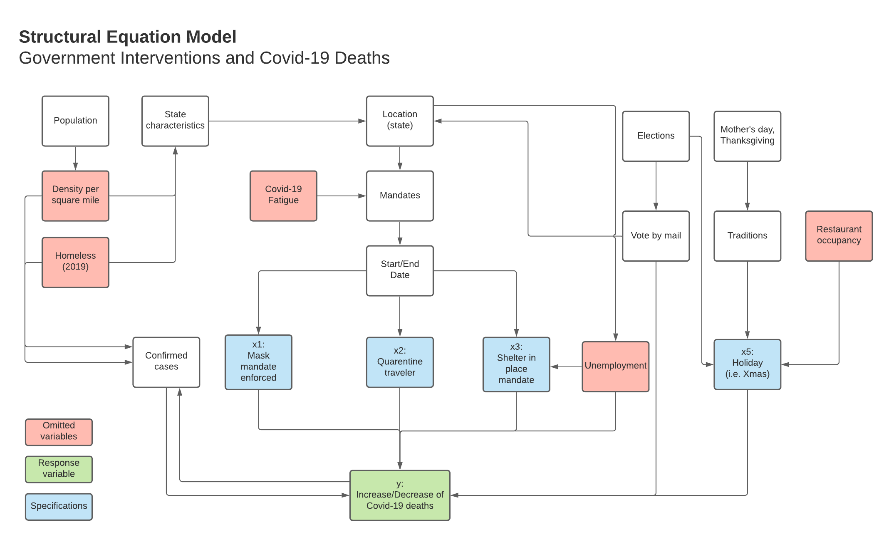

\clearpage

```{r setup, include=FALSE}
knitr::opts_chunk$set(echo = FALSE, warning = FALSE, message = FALSE, fig.align = 'center')
```

```{r libraries, echo=FALSE, warning=FALSE, message=FALSE}
options(repos="https://cran.rstudio.com" )

library(usmap)
library(stargazer)
library(tidyverse)
library(magrittr)
library(ggplot2)
library(sandwich)
library(lmtest)
library(car) #use vif function
library(cowplot)
library(dplyr)
library(knitr)
library(waffle)
library(PerformanceAnalytics)
library(ggrepel)
library(gridExtra)
# library(kableExtra)
```

```{r get robust ses }
rse <- function(model) { 
  sqrt(diag(vcovHC(model)))
  }
```
# Introduction

The year 2020 is known as the worst year in memorable history.  When the first wave of Covid-19 hit the U.S. in full force in March of 2020, the U.S. government did not have a plan on how to handle a pandemic.

State governors were left to fend largely for themselves with little Federal government guidance or relief.  They individually made decisions to provide protection and guidance to their constituents in order to keep them safe amidst the covid-19 pandemic whilst trying to keep businesses afloat and manage the economy to the best of their abilities.  Individual states have opened and closed businesses, required masks, and taken other measures with varying degrees of success.  Because of this, it’s difficult to ascertain what works, what doesn’t, and what the impact of those well intentioned measures are on covid-19 deaths.  

It is critical that we reach a deeper understanding of these differences in order to respond with appropriate public policies. Our team will clean and analyse data to see what patterns we can find that can help inform U.S. state governors as they seek guidance on what policies are effective and to help them to make the best decisions possible for their constituents.  We recognize that the data will not be as perfect as we would like.  We plan to clean the data in order to enable a conformed dataset to ensure our research is performed with scientific rigor and integrity to the best of our ability. The plan is to take into account differences between states but also see what correlations we can find overall across the U.S by leveraging data across 4/12/2020 through 3/25/2021.

## Research Question
We want to understand if state level government interventions are correlated with Covid-19-deaths.  We defined government interventions as mask required in public, shelter in place, quarantine for travellers as it relates to covid-19 deaths.

**Our research question is: Is there an impact from government interventions on covid-19 death toll?**

A Structural Equation Model (SEM) was created to understand the relationship between the Covid-19 death toll and other factors, including the mandates (Fig 1).

{width=90%}

_Fig 1: Structural Equation Model for Covid-19 deaths and government interventions._

After completing the SEM, we considered also two subquestions:

- Is the period of +/- fifteen days prior to and after a holiday increasing the Covid-19 deaths?

- Is the population density influencing Covid-19 deaths?


From all the US holidays, we focused this study on three of them: Mother's day, Election day and Thanksgiving. We selected Mother's day because it's an important US holiday that occurred early in the pandemic, we chose election day because we expected many people might ignore recommended mandates in order to vote in person which may have an impact in Covid-19 deaths, and we picked Thanksgiving because it's the most popular travel holiday in the US.

Mandates were not enforced in multiple states consistently during the holidays. 
We calculated the death toll during a holiday period by subtracting the death toll at the end and start dates. Then we evaluated the effect of the mandates. For each covariate, we aggregated the total days when the mandate was in effect.

For example, the case when the mandate is enforced from the holiday to the next three days was considered as a total of four days.

# Model Building Process

## Data
In order to answer the research question, our team has gathered information from the following sources which are described below:

- The raw data was sourced from [COVID-19 Data Repository](https://github.com/CSSEGISandData/COVID-19/tree/master/csse_covid_19_data) by the Center for Systems Science and Engineering (CSSE) at Johns Hopkins University [1]. Data columns we are considering for our study:

_Table 1. Raw data from source files_

```{r table_raw, echo=FALSE}
# library(kableExtra)
raw_info<- data.frame(
  spec = c("US State",
           "Date",
           "Covid-19 Cases",
           "Mask mandate enforced - start",
           "Mask mandate enforced - end",
           "Shelter in place - start",
           "Shelter in place - end",
           "Quarantine for travelers - start",
           "Quarantine for travelers - end",
           "Population",
           "Density",
           "Elected party"),
  description = c("US State name or district",
                  "Date in format MM/DD/YYYY", 
                  "Counts include confirmed and probable (where reported)",
                  "Date in format MM/DD/YYYY",
                  "Date in format MM/DD/YYYY",
                  "Date in format MM/DD/YYYY",
                  "Date in format MM/DD/YYYY",
                  "Date in format MM/DD/YYYY",
                  "Date in format MM/DD/YYYY",
                  "Population from 2018",
                  "Population per square mile",
                  "State results in 2020 presidential elections")
)

knitr::kable(raw_info, 
             booktabs=TRUE,
             format = "latex",
             # caption= "TEST"
             )
```

- Holidays were taken from the python-holidays module.

- State results from presidential election were taken from [wikipedia](https://en.wikipedia.org/wiki/2020_United_States_presidential_election
).

## Data Loading 

We wrangled the data to achieve the following structure:

_Table 2. Processed data_

```{r table_processed, echo=FALSE}
raw_info2<- data.frame(
  spec = c("US State",
           "Covid-19 Cases",
           "Deaths",
           "Mask in public",
           "Shelter in place",
           "Quarantine for travellers",
           "Density",
           "Party"),
  description = c("US State name or district", 
                  "Case count for the state per 100k people",
                  "Death toll for the state per 100k people",
                  "Aggregated days when mask in public mandate was required (end date - start date)",
                  "Aggregated days when shelter in place was enforced (end date - start date)",
                  "Aggregated days when Quarantine for travellers was enforced (end date - start date)",
                  "Population per square mile",
                  "Democrat or Republican")
)

kable(raw_info2,  
      booktabs=TRUE,
      format = "latex"
      # caption="Table 2. Processed data from raw data"
      )
```

## Data Wrangling

The raw data included a full year across US States. We sliced the data specifically specifically for the three aforementioned holidays. We considered population density as it relates the three holidays we chose to study.

```{r new_vars, echo=FALSE, warning=FALSE, message=FALSE}
covid_df <- readr::read_csv("../data/processed/covid_states_mask_v2.csv")

# Standardized cases considering population
covid_df$covid_cases_mil <- ((covid_df$total_covid_cases - covid_df$covid_total_on_4_12_2020)/covid_df$population_2018)*100000

# Standardized death toll considering population
covid_df$covid_deaths_mil <- (covid_df$total_covid_deaths/covid_df$population_2018)*100000 

covid_df <- covid_df %>% mutate_at(vars(covid_cases_mil, covid_deaths_mil), funs(round(., 0)))

# Create a column as category of strict enforcement and low enforcement of mask mandate.
# covid_df$mask_mandate_rigor <- ifelse(covid_df$sum_facemask_enforced >=200, "High rigor", "Low rigor")
# str(covid_df)

covid_df$party <- ifelse(covid_df$winning_part_2020_presidential_election == "Democrat", 0, 1)

covid_df$log_deaths_mil <- log(covid_df$covid_deaths_mil)

### Data frames based on specific dates
## Elections
election_df <- readr::read_csv("../data/processed/covid_states_mask_election_day_v3.csv")

# Standardized death toll considering population
election_df$covid_deaths_std <- round((election_df$total_covid_deaths/election_df$population_2018)*100000, 0)

## Thanksgiving
thanks_df <- readr::read_csv("../data/processed/covid_states_mask_thxgiving_day_v3.csv")

# Standardized death toll considering population
thanks_df$covid_deaths_std <- round((thanks_df$total_covid_deaths/thanks_df$population_2018)*100000, 0)

## Mother's day
mothers_df <- readr::read_csv("../data/processed/covid_states_mask_mothers_day_v3.csv")

# Standardized death toll considering population
mothers_df$covid_deaths_std <- round((mothers_df$total_covid_deaths/mothers_df$population_2018)*100000, 0)

# Standardized cases considering population
mothers_df$covid_cases_mil <- ((mothers_df$total_covid_cases)/mothers_df$population_2018)*100000

# Transformed response variable
mothers_df$log_deaths_mil <- log(mothers_df$covid_deaths_std)

# Party
mothers_df$party <- ifelse(mothers_df$winning_part_2020_presidential_election == "Democrat", 0, 1)

## Mix column at different times

df<- merge(mothers_df[,c("X1","province_state", "party", "winning_part_2020_presidential_election", 
                         "population_density_sqmiles", "population_2018" ,"covid_deaths_std","sum_facemask_enforced",
                         "sum_shelter_in_place", "sum_quarantine_travellers" )], 
           election_df[,c("province_state", "covid_deaths_std","sum_facemask_enforced","sum_shelter_in_place",
                                    "sum_quarantine_travellers")], by = "province_state") %>%
  merge(thanks_df[,c("province_state", "covid_deaths_std","sum_facemask_enforced","sum_shelter_in_place",
                                    "sum_quarantine_travellers")], by = "province_state")

new_names<- c("province_state",  "X1", "party", 
              "winning_part_2020_presidential_election", "population_density_sqmiles", "population_2018",
"covid_deaths_std.m", "sum_facemask_enforced.m", "sum_shelter_in_place.m", "sum_quarantine_travellers.m",             "covid_deaths_std.e", "sum_facemask_enforced.e", "sum_shelter_in_place.e", "sum_quarantine_travellers.e",             "covid_deaths_std.t", "sum_facemask_enforced.t", "sum_shelter_in_place.t", "sum_quarantine_travellers.t")   

df<- df %>% `colnames<-` (new_names)

df$density <- ifelse(df$population_density_sqmiles>200, "High", ifelse(df$population_density_sqmiles<100,"Low","Med"))
```

The population density might affect how fast the virus spreads. We divided the states in three groups: High, Med, Low. High density includes all the states with more than 200 people per square mile, then med density is the interval between a 100 and 199, and low density is any value less than 100. 

```{r, fig.height=4, fig.width=8}
# Density impact
boxplot<- gather(df, "covid_deaths_std.m","covid_deaths_std.e","covid_deaths_std.t", key="holiday", value="deaths") 

boxplot$holiday <- factor(boxplot$holiday, 
                          levels = c("covid_deaths_std.m",
                            "covid_deaths_std.e",
                            "covid_deaths_std.t"))

boxplot$density <- factor(boxplot$density, levels = c("High", "Med", "Low"))

boxplot %>% ggplot(aes(x=holiday, y=deaths, color=density)) +
  geom_boxplot(fill= "darkgrey") +
  scale_x_discrete(labels=c("Mother's day", "Elections", "Thanksgiving"),
                   limits=c("covid_deaths_std.m",
                            "covid_deaths_std.e",
                            "covid_deaths_std.t"))+
  scale_color_manual(values=c("red","blue","green4")) +
  ggtitle("Death toll and holidays")
```

_Figure 2. Death toll during Election day, Mother's day and Thanksgiving._

Figure 2 shows how in low density states, the spread during multiple holidays didn't change significantly. On the other hand, medium and high density populations seem to have a lot of variation during thanksgiving. Finally, we notice how high density populations are more susceptible to change during holidays. The two states with very high death toll during the Thanksgiving holiday are Texas and Indiana. These two are far away from the average value of approximately 35 amongst the three holidays.

Figure 3 shows the impact of interventions as they relate to the selected holidays. Red observations represent Republicans and blue represent Democrats. We noticed that the shelter in place mandate seem to be more effective for the holiday earlier in the year (Mother's day). It could be that in the holidays later in the year, the mandate was lifted due to Covid-19 fatigue.

```{r multiple-holiday scatter}
library(grid)

#extract legend
# #https://github.com/hadley/ggplot2/wiki/Share-a-legend-between-two-ggplot2-graphs
# g_legend<-function(a.gplot){
#   tmp <- ggplot_gtable(ggplot_build(a.gplot))
#   leg <- which(sapply(tmp$grobs, function(x) x$name) == "guide-box")
#   legend <- tmp$grobs[[leg]]
#   return(legend)}


## Mothers day and interventions
a1<- ggplot(df, 
       aes(x=(sum_facemask_enforced.m), y= (covid_deaths_std.m)
           , color=winning_part_2020_presidential_election
           , size= population_density_sqmiles
           )) +
  geom_point() +
  # geom_text_repel(aes(label=province_state)) + 
  ggtitle("Public facemask" ) +
  xlab("") +
  ylab("Mother's day deaths") +
  theme(legend.position="none", 
        plot.title = element_text(size=12),
        axis.title = element_text(size=8)) +
  scale_color_manual(values=c("#F8766D","#619CFF"))


a2<- ggplot(df, 
       aes(x=(sum_shelter_in_place.m), y= (covid_deaths_std.m)
           , color=winning_part_2020_presidential_election
           , size= population_density_sqmiles
           )) +
  geom_point() +
  # geom_text_repel(aes(label=province_state)) + 
  ggtitle("Shelter in place") +
  xlab("") +
  ylab("") +
  theme(legend.position="none", 
        plot.title = element_text(size=12),
        axis.title = element_text(size=8)) +
  scale_color_manual(values=c("#F8766D","#619CFF"))

a3<- ggplot(df, 
       aes(x=(sum_quarantine_travellers.m), y= (covid_deaths_std.m)
           , color=winning_part_2020_presidential_election
           , size= population_density_sqmiles
           )) +
  geom_point() +
  # geom_text_repel(aes(label=province_state)) + 
  ggtitle("Quarantine for travelers") +
  xlab("") +
  ylab("") +
  theme(legend.position="none", 
        plot.title = element_text(size=12),
        axis.title = element_text(size=8)) +
  scale_color_manual(values=c("#F8766D","#619CFF"))

## Election days and interventions

b1<- ggplot(df, 
       aes(x=(sum_facemask_enforced.e), y= (covid_deaths_std.e)
           , color=winning_part_2020_presidential_election
           , size= population_density_sqmiles
           )) +
  geom_point() +
  # geom_text_repel(aes(label=province_state)) + 
  # ggtitle("Deaths and public facemask") +
  xlab("") +
  ylab("Elections Deaths") +
  theme(legend.position="none", 
        plot.title = element_text(size=12),
        axis.title = element_text(size=8)) +
  scale_color_manual(values=c("#F8766D","#619CFF"))

b2<- ggplot(df, 
       aes(x=(sum_shelter_in_place.e), y= (covid_deaths_std.e)
           , color=winning_part_2020_presidential_election
           , size= population_density_sqmiles
           )) +
  geom_point() +
  # geom_text_repel(aes(label=province_state)) + 
  # ggtitle("Deaths and public facemask") +
  xlab("") +
  ylab("") +
  theme(legend.position="none", 
        plot.title = element_text(size=12),
        axis.title = element_text(size=8)) +
  scale_color_manual(values=c("#F8766D","#619CFF"))

b3<- ggplot(df, 
       aes(x=(sum_quarantine_travellers.e), y= (covid_deaths_std.e)
           , color=winning_part_2020_presidential_election
           , size= population_density_sqmiles
           )) +
  geom_point() +
  # geom_text_repel(aes(label=province_state)) + 
  # ggtitle("Deaths and public facemask") +
  xlab("") +
  ylab("") +
  theme(legend.position="none", 
        plot.title = element_text(size=12),
        axis.title = element_text(size=8)) +
  scale_color_manual(values=c("#F8766D","#619CFF"))

## Thanksgiving deaths and inverventions

c1<- ggplot(df, 
       aes(x=(sum_facemask_enforced.t), y= (covid_deaths_std.t)
           , color=winning_part_2020_presidential_election
           , size= population_density_sqmiles
           )) +
  geom_point() +
  # geom_text_repel(aes(label=province_state)) + 
  # ggtitle("Deaths and public facemask") +
  xlab("") +
  ylab("Thanksgiving deaths") +
  theme(legend.position="none", 
        plot.title = element_text(size=12),
        axis.title = element_text(size=8)) +
  scale_color_manual(values=c("#F8766D","#619CFF"))

c2<- ggplot(df, 
       aes(x=(sum_shelter_in_place.t), y= (covid_deaths_std.t)
           , color=winning_part_2020_presidential_election
           , size= population_density_sqmiles
           )) +
  geom_point() +
  # geom_text_repel(aes(label=province_state)) + 
  # ggtitle("Deaths and public facemask") +
  xlab("days") +
  ylab("") +
  theme(legend.position="none", 
        plot.title = element_text(size=12),
        axis.title = element_text(size=8)) +
  scale_color_manual(values=c("#F8766D","#619CFF"))

c3<- ggplot(df, 
       aes(x=(sum_quarantine_travellers.t), y= (covid_deaths_std.t)
           , color=winning_part_2020_presidential_election
           , size= population_density_sqmiles
           )) +
  geom_point() +
  # geom_text_repel(aes(label=province_state)) + 
  # ggtitle("Deaths and public facemask") +
  xlab("") +
  ylab("") +
  theme(legend.position="none", 
        plot.title = element_text(size=12),
        axis.title = element_text(size=8)) +
  scale_color_manual(values=c("#F8766D","#619CFF"))

# mylegend<-g_legend(c1)

grid.arrange(a1, a2, a3,
             b1, b2, b3,
             c1, c2, c3,
             nrow = 3,
             ncol = 3,
             # mylegend,
             top=textGrob("Holidays and days of mandates"))
```

_Figure 3. Death toll during multiple holidays and relationship to Public face mask, shelter in place, and quarantine for travelers mandates._

We focused on a specific holiday, such as mother's day. The reason for focusing on this particular period of time is because we can see how multiple states were implementing interventions during the 30 days (holiday +/- 15 days). As we can see in the other holidays, the interventions become more binary (zero or the max value), sometimes with very few observations in each of them. 

For example, the shelter in place with only two states (California and New Mexico) with the mandate effective. We don't believe that would be a representative option to measure the impact of that intervention. This study will cover only the Mother's day period. California is a state with the highest population. New Mexico is the poorest state in the USA and with less hospitals and beds for Covid-19 patients [9].

## Study Design

We want to measure the impact of government interventions in the Covid-19 death toll during the Mother's day period. Each observation will be recorded at a state level. The model will be created by 51 observations, each of them composed of the following features:

_Table 3. Selected predictors and output variable._

```{r processed_data, echo=FALSE}
raw_info3<- data.frame(
  code = c("D",
           "M",
           "S",
           "Q",
           "P"),
  description = c("Death toll per 100k people",
                  "Aggregated days when mask in public required",
                  "Aggregated days when shelter in place was enforced",
                  "Aggregated days when Quarantine for travelers was enforced",
                  "Elected party affiliation"),
  domain = c("0 - 61", 
             "0 - 30",
             "0 - 30",
             "0 - 30",
             "Democrat (0) or Republican (1)")
)

kable(raw_info3,  
      booktabs=TRUE,
      format = "latex"
      # , caption="Table 2. Processed data from Mother's day")
 )
```

## Model goals

Three models seek to explain the impact of government interventions considering the specifications stated in the SEM in Figure 1, which showed the theoretical relationships between the increase or decrease of Covid-19 deaths and multiple factors. The heatmap below shows similar patterns by Covid-19 deaths and cases. We've chose deaths as our response variable because we believe there's a smaller variation embedded in how the deaths were recorded compared to Covid-19 cases across all the USA.

Figure 4 shows a death distribution by geographic state. It must be flagged here that Oregon changed the way they reported the total cases of confirmed cases and switched from number of tests to number of persons tested. There is a lot of variation from state to state that is linked to different approaches when measuring total cases. For this reason, we decided to use the variable of death toll instead of confirmed cases.

```{r plot_usa, echo=FALSE, warning=FALSE, message=FALSE, fig.height=5, fig.width=8}
 # a.par <- par(mfrow=c(1, 2))
p <- plot_usmap(data = mothers_df, values = "covid_deaths_std", regions = "states",
                color="red", labels=T) +
  labs(title = "U.S. States",
        subtitle = "COVID-19 Deaths by State.") +
  scale_fill_continuous(low = "white", high = "red", 
                        name = "COVID-19 Deaths", label = scales::comma) +
  theme(panel.background=element_blank(), legend.position = "right")
 
# Set label font size
p$layers[[2]]$aes_params$size <- 2

# c<- plot_usmap(data = mothers_df, values = "covid_cases_mil", regions = "states",
#                color="blue", labels=T, label_color="black") +
#   labs(title = "U.S. States",
#         subtitle = "COVID-19 Cases by State.") +
#   scale_fill_continuous(low = "white", high = "blue", 
#                         name = "COVID-19 Cases", label = scales::comma) +
#   theme(panel.background=element_blank(), legend.position = "right")
# 
# c$layers[[2]]$aes_params$size <- 2
# 
p
# c

# grid.arrange(p,c,nrows=1)
```

_Figure 4. Death toll by state._

\pagebreak
### Model 1: Limited model

The mask mandate has been subject to controversy since the pandemic started, having multiple countries and the WHO providing multiple standards on face mask use in community settings [2]. We believe that there is a negative correlation between Covid-19 deaths and the total days the mask in public mandate was required.

$$y = D = \beta_0 + \beta_1M$$

### Model 2: Extended model

The extended model includes the rest of the government interventions which are shelter in place and quarantine for travelers. We believe that during the holiday season, the mobility was increased in all the states. Is not always the case that the interventions coincided with the holidays. If our original intuition about mask mandate has a large effect, we expect to see that in the holidays when people had a higher interaction and consequentially, the Covid-19 deaths would be reduced if more interventions were in place. In all of the variables proposed in the extended model we expect a negative correlation to the response variable.

$$y = D = \beta_0 +\beta_1M +\beta_2S +\beta_3Q$$

### Model 3: Full model 

The full model will take into account the political party the state voted during 2020 elections. We chose this variable because democratic states supported the introduction of government interventions in a larger degree compared to republican states:

$$y = D = \beta_0 +\beta_1M +\beta_2S +\beta_3Q + + \beta_4P$$

## Statistical Methods

Before running the proposed models, we looked the correlation matrix of the variables of interest.

```{r echo=FALSE, fig.height=3.5, fig.width=8}
# Mother's day
chart.Correlation(mothers_df[,c("covid_deaths_std", 
                  "sum_facemask_enforced", 
                  "sum_shelter_in_place", 
                  "sum_quarantine_travellers" 
                  # "sum_facemask_citation_fine"
                  )],
      # histogram=TRUE,
      # diagonal = "hist",
      # pch=19,
      labels = c("deaths",
                  "mask in public",
                  "shelter in place",
                  "quarantine for travelers")
      # lower= c("cor","none")
    )
mtext("Matrix Correlation: Deaths and Interventions", side=3, line=3)
```

_Figure 5. Correlation matrix for death toll, public face mask, shelter in place, and quarantine for travelers during Mother's day._

The correlation matrix (Figure 5) provides the big picture of the relationships between all the variables of interest. It seems that Covid-19 deaths is not normally distributed, showing a skew to the left. Days of shelter in place has a large skew to the left.
The remaining variables, days of face mask enforced, days of quarantine for travelers, and days of mask enforced during holiday seemed to be part of two populations.

### Facemask required in public spaces

The states with lowest Covid-19 deaths are Hawaii, Alaska, Maine, Vermont and Oregon. They all seem to have a similar population density except for Alaska. Hawaii is naturally isolated to the rest of the US States. It might even be considered an outlier in terms of connectivity with the rest of the states [3]. 

```{r, fig.height=4, fig.width=8}

# Set it globally:
# options(ggrepel.max.overlaps = 5)

p2<- ggplot(df,
       aes(x=(sum_facemask_enforced.m), y= (covid_deaths_std.m)
           , color=winning_part_2020_presidential_election
           # , size=population_density_sqmiles
           , size= population_density_sqmiles
           )) +
  geom_point() +
  geom_text_repel(aes(label=province_state)) +
  ggtitle("Deaths and public facemask - Mother's day") +
  xlab("days") +
  ylab("Covid-19 deaths per 100k") +
  theme(legend.position="right") +
  labs(size="Density, in/sq.miles",
       color="Party") +
  scale_color_manual(values=c("#F8766D","#619CFF"))

grid.arrange(p2, 
             # p2, 
             nrow = 1)
```

_Figure 6. Relationship between death's and effective days of public face masks._

It is evident that states with the highest density seem to land  towards the top right of the plot (Figure 6). We can also notice that most of the democratic states had a longer public face mask mandate requirement period while the majority of republican states didn't required it. 

The second state with lowest deaths is Vermont, which has been set as an example to the US, following a strict interventions from the beginning of the pandemic [4]. Oregon seems to have follow a strict path similar to Vermont, in both states, there has been 'relatively good adherence with guidelines' [5]. 

### Shelter in place


```{r, fig.height=4, fig.width=8}
## Shelter in place - Mother's day

# Scatterplot
p2<- ggplot(mothers_df, 
       aes(x=(sum_shelter_in_place), y= (covid_deaths_std)
           , color=winning_part_2020_presidential_election
           # , size=population_density_sqmiles
           , size= population_density_sqmiles
           )) +
  geom_point() +
  geom_text_repel(aes(label= province_state)) + 
  ggtitle("Deaths and Shelter in place - Mother's day") +
  xlab("days") +
  ylab("Covid-19 deaths per 100k") +
  theme(legend.position="right") +
  labs(size="Density, in/sq.miles",
       color="Party")+
  scale_color_manual(values=c("#F8766D","#619CFF"))

grid.arrange(p2, 
             # p2, 
             nrow = 1)
```

_Figure 7. Relationship between death's and effective days of shelter in place._

In Figure 7 we see only two points with a longer shelter in place mandate compared to the rest of the states.  In general, days of shelter in place doesn't seem to have an influence on our response variable. We do see that most Democrat states seem to had the mandate for longer compared to Republican states.


### Quarantine for travellers


```{r, fig.height=4, fig.width=8}
# Scatterplot
p2<- ggplot(df, 
       aes(x=(sum_quarantine_travellers.m), y= (covid_deaths_std.m)
           , color=winning_part_2020_presidential_election
           # , size=population_density_sqmiles
           , size= population_density_sqmiles
           )) +
  geom_point() +
  geom_text_repel(aes(label= province_state)) + 
  ggtitle("Deaths and Quarantine for travelers - Mother's day") +
  xlab("days") +
  ylab("Covid-19 deaths per 100k") +
  theme(legend.position="right") +
  labs(size="Density, in/sq.miles",
       color="Party") +
  scale_color_manual(values=c("#F8766D","#619CFF"))

grid.arrange(p2, 
             # p2, 
             nrow = 1)
```

_Figure 8. Relationship between death's and effective days of quarantine for travelers._

The histogram of quarantine for travelers (Figure 5) shows the distribution of quarantine for travelers with a large skew to the left. It implies that most of the states didn't have the mandate for a long time. Possibly a transformation of the variable quarantine for travelers might be used. After reviewing Figure 8, we decided to not transform this variable.

### Party Elected in 2020 President Election

```{r party_comparison, fig.height=4, fig.width=6}
par(mfrow=c(1,2))

# party - MOther's day
hist(mothers_df$party,
     main = "States by elected party in 2020",
     xlab = "0: Dem, 1: Rep")

boxplot((covid_deaths_std.m)~party, data=df, 
        xlab="Dem:0, Rep:1",
        ylab="Deaths",
        main= "State party affiliation, \nMother's day")
```

_Figure 9. (Left) Histogram of state affiliation. Figure 10. (Right) Distribution of death's by party affiliation in 2020 presidential elections._

The histogram in Figure 9 shows that the states are almost evenly divided by Republican versus Democrat, where the latter has a minor lead (+1). Democrats have a larger average death toll and a wider distribution compared to Republicans (Figure 10). We also want to point at the impact of high population density may be the reason for such variation (Figure 7) because all the highest population states are democratic.

## Regression Table

### Model 1: Optimized Limited model

To reduce standard errors we modeled the public face mask required variable as a second degree polynomial. We observed that the residuals didn't have a significant deviaiton from zero after the optimization (Figure 11).

$$y = D = \beta_0 + \beta_1M + \beta_2M^2$$

### Model 2: Optimized Extended model

The extended model was optimized by modeling the shelter in place variable as a second degree polynomial, residuals showed a smaller deviation from zero.

$$y = D = \beta_0 +\beta_1M + \beta_2M^2 +\beta_3S +\beta_4S^2 +\beta_5Q$$

### Model 3: Full model 

We kept the model two and added the party affiliation variable as planned.

$$y = D = \beta_0 +\beta_1M + \beta_2M^2 +\beta_3S +\beta_4S^2  +\beta_5Q + \beta_6P$$
After analyzing the variance inflation, we decided to drop the variable shelter in place creating an optimized model three.

$$y = D = \beta_0 +\beta_1M + \beta_2M^2  +\beta_5Q + \beta_6P$$

```{r models}
model_one <- lm(covid_deaths_std ~ 
                  sum_facemask_enforced + I(sum_facemask_enforced^2)
                , data = mothers_df)

model_two <- lm(covid_deaths_std ~ 
                  sum_facemask_enforced + I(sum_facemask_enforced^2) +
                  sum_shelter_in_place + I(sum_shelter_in_place^2) +
                  sum_quarantine_travellers 
                # + sum_holiday_face_mask_citation_fine,
                , data = mothers_df)

model_three <- lm(covid_deaths_std ~ 
                    sum_facemask_enforced + I(sum_facemask_enforced^2) +
                  # sum_shelter_in_place + I(sum_shelter_in_place^2) +
                  sum_quarantine_travellers 
                  # + sum_holiday_face_mask_citation_fine
                  + party,
                data = mothers_df)
```

We present the results of the three models studied in Table 4.

```{r, results='asis'}

# stargazer example
stargazer(model_one, model_two, model_three,
  # type="text",
  se = list(rse(model_one),rse(model_two), rse(model_three)),
column.labels = c("M","M+S+Q","M+Q+P"),
dep.var.labels   = "Death toll per 100k inhabitants",
covariate.labels = c("mask in public", "mask in public sqrd",
                     "shelter in place", "shelter in place sqrd",
                     "quarantine travelers",
                     "party"),
add.lines = list(c("optimized model", "Yes", "Yes","Yes")),
header=FALSE, type='latex',
title = "Regression results"
)

```

_Table 4. Regression results of the three optimized models._

# Model Limitations

## IID

Each state is geographically dependent of the neighbors and political affiliations. Even when interventions were in place by the government, there is no way to know if the people followed the guidelines en mass. The model hardly complies with this requirement, however we consider for this study that the sample is representative of the USA population at the time period of data collection used in the study and the sample size can be considered not small.

## Linearity

```{r}
# Evaluate for each model and specification
mothers_df <- mothers_df %>%
  mutate(
    predict_model_one = predict(model_one),
    resid_model_one = resid(model_one)
  )

mothers_df <- mothers_df %>%
  mutate(
    predict_model_two = predict(model_two),
    resid_model_two = resid(model_two)
  )

mothers_df <- mothers_df %>%
  mutate(
    predict_model_three = predict(model_three),
    resid_model_three = resid(model_three)
  )
```

For the model one, we have only one specification: mask required in public. We found the residuals had a parabolic trend. For model two we shelter in place residuals were also parabolic. The linearity assumptions was threaten and we optimized the model modeling public face mask and shelter in place as polynomials of second degree. See Figure 11 for model three optimized model plots.

```{r model one residuals}
## Commented because similar to model three
# mask_resid_m1 <-  mothers_df %>% 
#   ggplot(aes(sum_facemask_enforced, resid_model_one)) + 
#   geom_point() + 
#   stat_smooth() +
#   ggtitle("Reduced model - Specifications vs Residuals") +
#   xlab("days face mask required")
# 
# mask_resid_m1
```

```{r model two spec residuals}
## Commented because similar to model three
# mask_resid_m2 <-  mothers_df %>% 
#   ggplot(aes(sum_facemask_enforced, resid_model_two)) + 
#   geom_point() + 
#   stat_smooth()
# 
# shelter_resid_m2 <-  mothers_df %>% 
#   ggplot(aes(sum_shelter_in_place, resid_model_two)) + 
#   geom_point() + 
#   stat_smooth()
# 
# quarantine_resid_m2 <-  mothers_df %>% 
#   ggplot(aes(sum_quarantine_travellers, resid_model_two)) + 
#   geom_point() + 
#   stat_smooth()
# 
# # holiday_resid_m2 <-  covid_df %>% 
# #   ggplot(aes(sum_holiday_face_mask_citation_fine, resid_model_two)) + 
# #   geom_point() + 
# #   stat_smooth()
# 
# # party_resid_m2 <-  mothers_df %>%
# #   ggplot(aes(party, resid_model_two)) +
# #   geom_point() +
# #   stat_smooth()
# 
# grid.arrange(mask_resid_m2,
#              shelter_resid_m2,
#              quarantine_resid_m2,
#              # holiday_resid_m2,
#              # party_resid_m2,
#              nrow = 2,
#              top = "Model 2 - Specifications vs Residuals")
```

```{r}
mask_resid_m3 <-  mothers_df %>% 
  ggplot(aes(sum_facemask_enforced, resid_model_three)) + 
  geom_point() + 
  stat_smooth()+
  xlab("public face mask days")

shelter_resid_m3 <-  mothers_df %>% 
  ggplot(aes(sum_shelter_in_place, resid_model_three)) + 
  geom_point() + 
  stat_smooth()+
  xlab("shelter in place days")

quarantine_resid_m3 <-  mothers_df %>% 
  ggplot(aes(sum_quarantine_travellers, resid_model_three)) + 
  geom_point() + 
  stat_smooth()+
  xlab("quarantine for travelers days")

party_resid_m3 <-  mothers_df %>%
  ggplot(aes(party, resid_model_three)) +
  geom_point() +
  stat_smooth()+
  xlab("0: Dem, 1: Rep")

grid.arrange(mask_resid_m3,
             shelter_resid_m3,
             quarantine_resid_m3,
             party_resid_m3,
             nrow = 2,
             top = "Full model - Specifications vs Residuals") 
```

_Figure 11. Specifications vs residuals for optimized model three._

## No perfect collinearity

We know the variables chosen didn't have perfect collinearity because we were able to run the model without singularity problems. Also, we analyzed in the full model which variable is bringing the most inflation to our predictions. Public face mask and shelter in place are both increasing the model variation significantly. We decided to drop shelter in place from model three to optimize the error in the model. We kept public face mask because it's the variable of interest in this study.

```{r vif-coeff}
# vif(model_three)
# coeftest(model_three, vcovHC)
```
After droping the shelter in place specification from model three a slight improvement in the R square adjusted was obtained.

## Homoskedastic errors

It is clear that the model three has a clear deviation from zero when values are small (Figure 12). A similar behavior is seen in the Scale-location plot (Figure 13) where the slope dramatically decreases as the values increase, instead of a flat smooth curve. For this reason, the validity of the t-tests and p-values are threatened.

```{r, fig.height=3, fig.width=6}
par(mfrow=c(1,2))
plot(model_three, which = 1)
plot(model_three, which = 3)
```

_Figure 12. (Left) Residuals vs Fitted for optimized model three show deviation in the middle. Figure 13. (Right) Scale-Log shows a constant increase in the standardized residual values as the fitted value increases._

## Normality of errors

The histogram is skewed to the left, possibly having normality deviations in both tails (Figure 14). The qq-plot (Figure 15) shows that the errors are not normally distributed, as expected, in both ends of the tail for values less than -1 and 1. The validity of the standard errors reported in this study is threatened.

```{r, fig.height=3, fig.width=6}

plot_one <- mothers_df %>% 
  ggplot(aes(x = resid_model_three)) + 
  geom_histogram()
  
plot_two <- mothers_df %>% 
  ggplot(aes(sample = resid_model_three)) + 
  stat_qq() + stat_qq_line()

grid.arrange(plot_one, plot_two,
             nrow=1)
```

_Figure 14. (Left) Residuals histogram for model three. Figure 15. (Right) QQ-Plot of residuals of optimized model three._

## Zero conditional mean 

The average residual deviates from zero in a parabolic share (Figure 14). Also, we believe that Massachusetts might be an outlier in the data set because of the Cook's D value (Figure 16). We theorize this is due to Massachusetts proximity to New York, which was the epicenter of the pandemic earlier year.

```{r Cooks D, fig.height=4, fig.width=6}
plot(model_three, which=4)
```

_Figure 16. Cook's D for optimized model three._

# Discussion of Omitted Variables

We believe that there are multiple factors at play when it comes to considerations around COVID-19 deaths. It is likely that our models are biased due to omitted variables. We listed out those variables as possible limitations to our models. 

**Density per square mile (d)**

We were not able to get accurate current data on the population density for all of the states.  Also, getting the population density of a given state may not give us a true picture of the population density.  For example, majority of the people in Nevada live in the Las Vegas area.  Nevada has a low population density at the state level, but in reality has a much higher population density as the population is concentrated around the city of Las Vegas. Covid-19 infection is spread by close contact with infected people and higher the population density leads to higher rate of infection and death. [6].

D = M, OV=d        D&M (-), D&d(+), M&d(+)  Away from zero, large

**Restaurant occupancy (r)**

Restaurants were closed by mandate inconsistently across states.  Even for those restaurants that were ordered to close, some businesses chose to defy the guidance and opened anyway.  The volume of patrons visiting restaurants during Mother's day, may have influenced the spread and deaths related to Covid-19.

D = M, OV=r       D&M (-), D&e (+), M&r (-) Towards zero, small

**Unemployment (u)**  

The US unemployment rate peaked at 14.8% in April, 2020. [8] Millions of people lost their jobs and were not able to work.  We do not have data on the impact of people not being able to go to work on the Covid-19 infections.  If the umemployed stayed at home, they had the potential of infecting others in the household.  On the other hand, by staying at home, the unemployed had less exposure to Covid-19 compared to physically going to work in an office/restaurant type environment. 

D = M, OV=u   D&M (-), D&u (-), M&u (-) Towards zero, small

**Homelesness (h)**

We do not have data on the homeless population for each state and how they potentially contributed to the spread of Covid-19 infections.  Also, homeless people are less likely to have the resources to purchase masks and other means of protection from Covid-19 infections.  We also do not have the data on location of the homeless population - urban or rural areas.  

D = M, OV=h       D&M (-), D&h (+), D&h (+) Away zero, small

**Covid-19 Fatigue (f)**

While it is difficult to measure Covid-19 fatigue, as the pandemic wore on, people had increased difficulty with social distancing.  People began to weigh mental health impact on isolation vs. the risk of following safety guidelines in favor of ignoring safety guidelines.  We saw evidence of this from people gathering for spring break and end of year holidays such as Thanksgiving and Christmas.


D = M, OV=f       D&M (-), D&f (+), M&f (+) Away zero, large

_Table 5. Summary of omitted variable bias._

```{r}
raw_info4<- data.frame(
  OV = c("Density per square mile",
           "Restaurant occupancy",
           "Unemployment",
           "Homelessness",
           "Covid-19 Fatigue"),
  Bias = c("Away from zero",
                  "Toward zero",
                  "Toward zero",
                  "Away from zero",
                  "Away from zero"),
  Effect_size = c("Large", 
             "Small",
             "Small",
             "Small",
             "Large")
)

kable(raw_info4,  
      booktabs=TRUE,
      format = "latex"
      # caption="Table 3. Omitted variable bias for optimized model three."
      )
```


# Conclusion

After evaluating three models and optimized them to comply with the classical linear model assumptions, we found the model three was the best. The optimized model three used only data from mother's day (+/- 15 days), a time relatively early in the pandemic when guidelines in multiple states were in place and people were heeding the guidelines.

The optimized model three considered public face mask mandate, quarantine for travelers and the affiliated party during the presidential election as covariates. We encountered threats to validity of the standard error, F-test, t-value and p-value due to homoskedastic error and fail to comply with normality of errors. The results of this study will focus only in the coefficients of the input variables of the optimized model three.

$$y = D = 11.51 -0.22\cdot M_d + 0.04 \cdot M_d^2  -0.13 \cdot Q_d -5.92 \cdot P_d \qquad (1)$$

We found a negative correlation between deaths and public face mask, quarantine for travelers and the state's political affiliation. This relationship matched our initial theory.

Based on Figure 1: Structural Equation Model (SEM) for Covid-19 deaths and government interventions, we can see that over a thirty day period, a maximum of six lives were saved per hundred thousand people in the states that had a public mask mandate in effect during Mother's day. Quarantine for travelers saves approximately three lives per hundred thousand. The political affiliation of the state based on 2020 presidential elections had a negative correlation with deaths. If the state was Republican, an estimated of 6 lives were saved per hundred thousand people. We found this effect may be influenced due to low population density in republican states. Highest population density states were largely democratic (see Figure 6).

Having said that, we must emphasize that our optimized model three is not a good estimator for deaths. The R square adjusted is low, with a value of 0.57, meaning that there's a large amount of variation not explained by our model.
  


# References

[1] Dong E, Du H, Gardner L. An interactive web-based dashboard to track COVID-19 in real time. Lancet Inf Dis. 20(5):533-534. doi: 10.1016/S1473-3099(20)30120-1

[2] Feng et al. (2020, March). Rational use of face masks in the COVID-19 pandemic. Retrieved April 05, 2021, from https://www.thelancet.com/journals/lanres/article/PIIS2213-2600(20)30134-X/fulltext

[3] Garza, A. (2020, November 25). Hawaii is Keeping COVID-19 under Control. Why? Retrieved April 15, 2021, from https://time.com/5915084/hawaii-covid-coronavirus/

[4] Bloomberg.com. (n.d.). Retrieved April 15, 2021, from https://www.bloomberg.com/news/articles/2021-01-06/n-y-s-neighbor-keeps-cases-lowest-in-u-s-throughout-pandemic

[5] Nigel Jaquiss | Published December 23, 2., &amp; About Nigel Jaquiss News reporter Nigel Jaquiss joined Willamette Week in 1998. He covers politics. (n.d.). Oregon fares better than nearly all States by two Key COVID-19 Measures. Retrieved April 15, 2021, from https://www.wweek.com/news/2020/12/23/oregon-fares-better-than-nearly-all-states-by-two-key-covid-19-measures/

[6] How coronavirus spreads. (n.d.). Retrieved April 15, 2021, from https://www.cdc.gov/coronavirus/2019-ncov/prevent-getting-sick/how-covid-spreads.html

[7] How we voted in 2020. (n.d.). Retrieved from http://electionlab.mit.edu/sites/default/files/2020-12/How-we-voted-in-2020-v01.pdf

[8] Unemployment Rates During the COVID-19 Pandemic: In Brief. (n.d.). Retrieved from https://fas.org/sgp/crs/misc/R46554.pdf

[9] Romero, S. (2020, April 24). How new Mexico, one of the POOREST States, averted a Steep death toll. Retrieved April 15, 2021, from https://www.nytimes.com/2020/04/24/us/coronavirus-new-mexico.html

[10] Stone, W. (2020, October 24). Rural Midwestern Communities hit hard As coronavirus surges In U.s. again. Retrieved April 15, 2021, from https://www.npr.org/2020/10/24/927384374/rural-midwestern-communities-hit-hard-as-coronavirus-surges-in-u-s-again